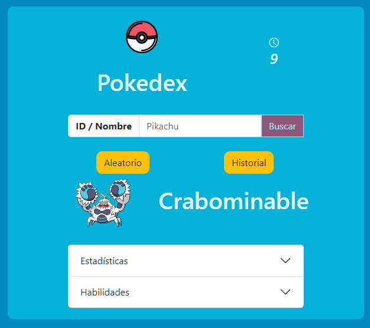

# Pokedex Web App



## Descripción

La Pokedex Web App es una aplicación web que funciona como una Pokedex, donde podrás descubrir información sobre diversos Pokemones. La aplicación presenta las siguientes características y funcionalidades:

1. **Visualización aleatoria de Pokemones:** Cada 30 segundos, la Pokedex muestra un Pokemon aleatorio, permitiéndote descubrir nuevas criaturas de forma sorpresiva.

2. **Búsqueda por ID o nombre:** Puedes buscar Pokemones específicos utilizando su número de identificación (ID) o su nombre. Esto te permitirá encontrar rápidamente la información de cualquier Pokemon que desees conocer.

3. **Mostrar un nuevo Pokemon aleatorio:** Además de la visualización periódica de Pokemones aleatorios, puedes activar manualmente la opción para mostrar otro Pokemon completamente al azar.

## Live Demo

Puedes probar la Pokedex Web App en el siguiente enlace: [Live Demo](https://eduardovisa-pokedex.netlify.app/)

## Tecnologías Utilizadas

La Pokedex Web App ha sido desarrollada utilizando las siguientes tecnologías:

- JavaScript: Se ha utilizado JavaScript para implementar la funcionalidad interactiva y el manejo de eventos en la aplicación.

- Fetch API: Para obtener y manejar los datos de la API de Laravel, se ha utilizado la función Fetch API de JavaScript.

- HTML: La estructura y el contenido de la aplicación se han creado utilizando HTML.

- CSS: Se ha aplicado CSS para estilizar y dar formato a la interfaz de usuario de la Pokedex.

- Bootstrap: Principalmente se ha empleado Bootstrap para el diseño y la maquetación responsive de la página, lo que permite que la aplicación se vea y funcione de manera óptima en diferentes dispositivos y tamaños de pantalla.

## Repositorios

- Repositorio de la Pokedex Web App: [https://github.com/eduardovisa/pokedex.git](https://github.com/eduardovisa/pokedex.git)

- Repositorio del Proyecto de Laravel (API): [https://github.com/eduardovisa/laravel-pokedex-project.git](https://github.com/eduardovisa/laravel-pokedex-project.git)

## Instalación

Para ejecutar localmente la Pokedex Web App, sigue estos pasos:

1. Clona el repositorio de la Pokedex desde GitHub:

```bash
git clone https://github.com/eduardovisa/pokedex.git
```
